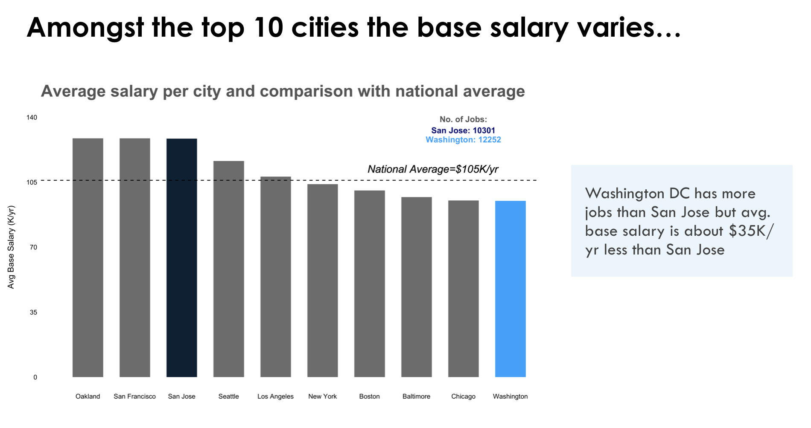

# Best cities to live for a data scientist in USA

USF MSDS - Exploratory Data Analysis and visualization project 
Team Members: Sakshi Singla, Ivette Sulca

## Data: 
#### Data Science Job Opportunities:
Sources: **indeed.com** (Job Listings) and **glassdoor.com** (Salary) 
Job Listings: data for number of job listings in 45 US cities for:Data Scientist, Data Engineer, and Data Analyst positions 
Salary: data for US cities with top 10 number of job listings for: 
Average base salary (does not include cash bonuses) 
National average and variation per city  
#### Quality of Life Index:
Source: **Numbeo** 
Per Country: https://www.numbeo.com/quality-of-life/country_result.jsp?country=United+States 
Per City: https://www.numbeo.com/quality-of-life/rankings.jsp 
The number of observations for the quality of life dataset per city were 206 and quality of life per country were 35. In addition, we obtain the data historically for the last three years to analyze the quality of life variance.

## Sample visualizations:

